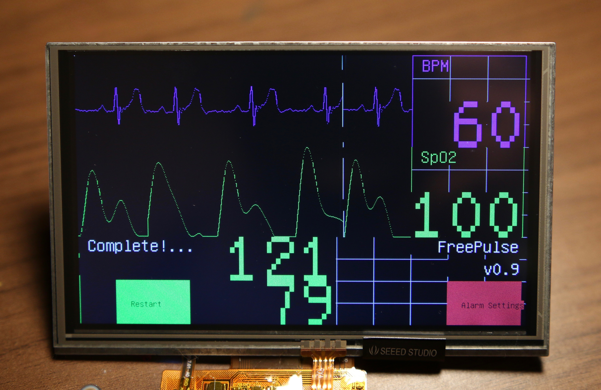

# FreePulse Patient Monitor

This is the code base for [FreePulse][FreePulse], a low cost patient monitor designed for developing world
hospitals and resource-limited settings. Inspired by my experiences working in rural hospitals in Rwanda and Nepal,
FreePulse is designed with the intention of providing hospital-grade diagnostic information in a simple to use, durable 
package to doctors at an affordable price. A brief overview of the project is available on the project website, and 
a more detailed post about the motivation and history of the project is on the development blog.

- [Project website][FreePulse]
- [Development blog][blog]

Current Project Goals
---------------------

1. Successful migration to STM32F4 from Teensy 3.2

	- Restore SPI peripheral functionality

	- Restore ECG functionality

2. Completing remaining sensors

	- SpO2 sensor

	- NIBP system

3. Develop final PCB

4. Extend functionality through new peripheral modules

	- SD card storage

	- Bluetooth (?)

[FreePulse]: http://www.freepulsemed.com
[blog]: http://reecestevens.me/blog
